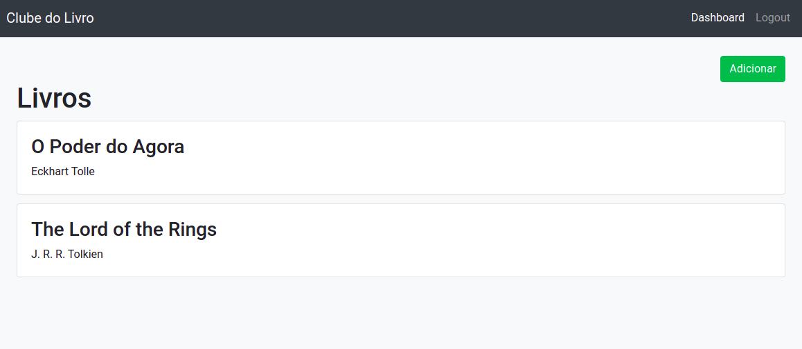

# Clube do Livro

## Back-end

Api implementada em PHP/Laravel usando JSON e o padrão REST, com banco de dados em MySQl.

A api possuí autenticação baseada em tokens de acesso. O aplicativo recebe um token de acesso depois que um usuário autentica e autoriza o acesso com êxito e, em seguida, passa o token de acesso como uma credencial ao chamar a API de destino. O token transmitido informa à API que o portador do token foi autorizado a acessar a API e executar ações específicas especificadas pelo escopo que foi concedido durante a autorização.

Laravel Sanctum fornece um sistema de autenticação leve para SPAs (aplicativos de página única), aplicativos móveis e APIs simples baseadas em tokens. O Sanctum permite que cada usuário de seu aplicativo gere vários tokens de API para sua conta. Esses tokens podem receber habilidades / escopos que especificam quais ações os tokens podem realizar.

### End-points da API

Rotas Públicas:

// Auth Routes                 

POST /api/register
POST /api/login
        
// Livros 
GET /api/livros
GET /api/livros/{id}
GET /api/livros/search/{titulo}
  
// Livros - Users              
GET /api/users/livros
GET /api/users/livros/{id}

Rotas Protegidas:

// Auth Routes
POST api/logout
    
// Livros                  
POST /api/livros
PUT /api/livros/{id}
DELETE /api/livros/{id}

// Livros - Users          
POST /api/users/livros
PUT /api/users/livros/{id}
DELETE /api/users/livros

### Modelos

* Livro:

{
    "id": 1,
    "titulo": "O Poder do Silêncio",
    "autor": "Eckhart Tolle",
    "descricao": "New York Times bestselling author Eckhart Tolle",
    "imagem": "https://images-na.ssl-images-amazon.com/images/I/51VBUzYc4VL.jpg",
	"created_at": "2021-05-28T12:09:16.000000Z",
	"updated_at": "2021-05-28T12:09:16.000000Z"
}

* Join table - LivroUser:

{
    "id": 1,
    "user_id": 1,
    "livro_id": 1,
    "reservado": 0,
    "created_at": "2021-05-28T12:27:32.000000Z",
	"updated_at": "2021-05-28T12:27:32.000000Z"
}

## Front-end

App implementado em VueJs

### APP Overview

